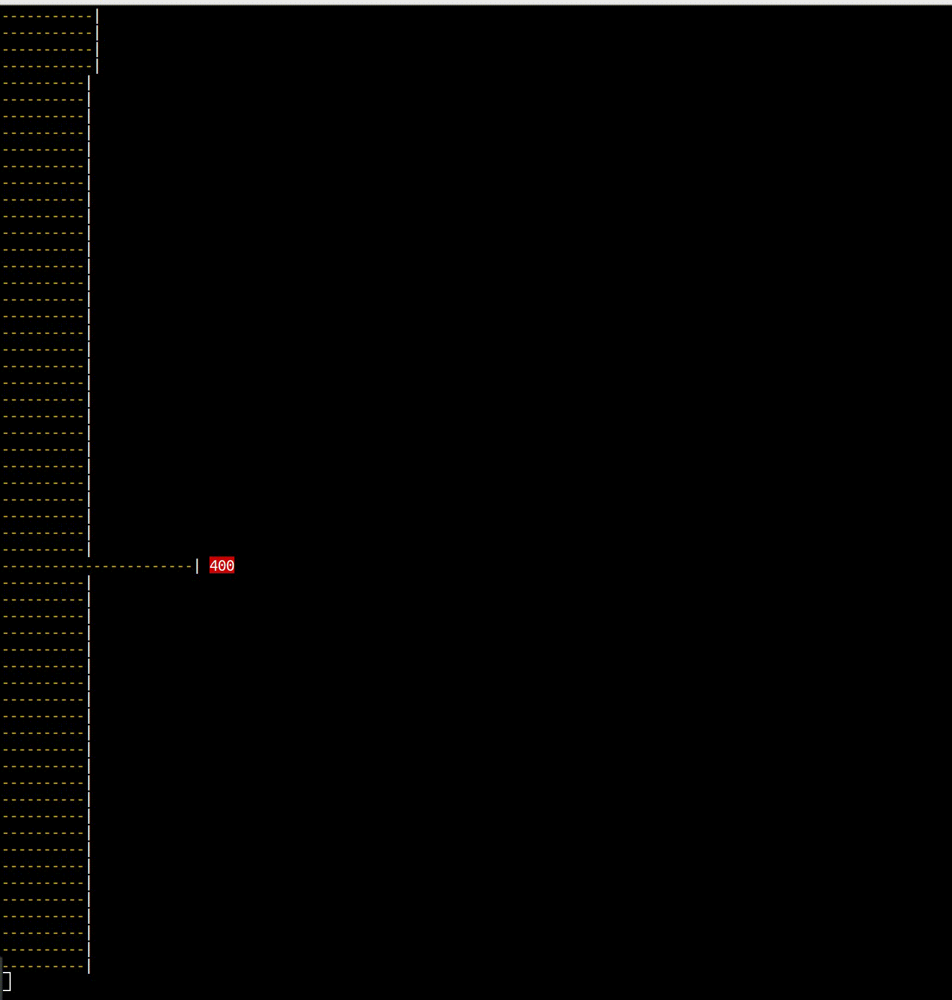

Command line DFT and tone generator. See live demo on
[YouTube](https://www.youtube.com/watch?v=hwsOKpBg6zo). It's also a bit of an
exuse to use some of the newer features of C++.

# Build and run demo
```bash
$ make demo
clang++ -Wall -O3 -Wpedantic -pedantic-errors -std=c++14 -o tonegen.o -c tonegen.cpp
clang++   tonegen.o   -o tonegen
clang++ -Wall -O3 -Wpedantic -pedantic-errors -std=c++14 -o chord.o -c chord.cpp
clang++ -Wall -O3 -Wpedantic -pedantic-errors -std=c++14 -o fourier.o -c fourier.cpp
clang++   chord.o fourier.o   -o chord
clang++ -Wall -O3 -Wpedantic -pedantic-errors -std=c++14 -o spectrum.o -c spectrum.cpp
clang++   spectrum.o fourier.o   -o spectrum
./tonegen 220 276 330 | ./chord
Twid 0.182997
Proc 2.88526
Bins 1000
Sample rate 2000 Hz
Bin resolution 2 Hz
__________________________________________________________________________
  | |  | | |  | |  | | |  | |  | | |  | |  | | |  | |  | | |  | |  | | |  
  | |  | | |  | |  | | |  | |  | | |  | |  | | |  | |  | | |  | |  | | |  
__________________________________________________________________________
                                             ^   ^   ^                    
./tonegen 11.5 21 32 | ./spectrum | head -40
Twid 0.185275
Proc 2.59592
Bins 1000
Sample rate 2000 Hz
Bin resolution 2 Hz
---------| 
---------| 
-----------| 
--------------| 
---------------------------| 
--------------------------------------------------------------| 12 ?
----------| 
---------| 
---------------| 
----------------------------------------------| 
-----------------------------------------------| 
----------------| 
----------| 
-------| 
-----| 
---------------------------------------------------------------------------| 32 B0
----| 
---| 
---| 
--| 
--| 
--| 
--| 
--| 
-| 
-| 
-| 
-| 
-| 
-| 
-| 
-| 
-| 
-| 
-| 

```

# Three tones interacting


# Analyse mic
```bash
make live
```
# Files
The main file is [fourier.cpp](fourier.cpp). There's also a tone generator
[tonegen.cpp](tonegen.cpp), a common include file [riff.h](riff.h) where the
WAV header is defined and [notes.h](notes.h) which is an associative array of
frequencies to note letters.

```fourier.cpp``` takes a WAV on stdin and prints an ASCII art keyboard showing
the peaks as key presses.

```tonegen.cpp``` takes up to three frequencies in Hertz as parameters and
writes a WAV to stdout. This can be piped to a player such as ```aplay``` or to
```fourier``` for analysis.

```bash
# Generate major chord and send it to the speaker
./tonegen 440 550 660 | aplay

# Generate chord and analyse it
./tonegen 440 550 660 | ./fourier
```

# Spectrum
Frequency spectrum analyser. The results are normalised against the largest
bin, so for quiet environments the noise floor will jump up.


# Sample rate
A sample rate of 2000 and a bin count of 2048 allows frequencies up to 1000 Hz
to be measured at a sub-1 Hz resolution. This gives a key range of C0 to B5.

```bash
$ clang++ --version
clang version 3.8.0-2ubuntu4 (tags/RELEASE_380/final)
Target: x86_64-pc-linux-gnu
Thread model: posix
InstalledDir: /usr/bin
```

# Coding standard and linter
There's a make rule to run ```cppcheck``` and one to run ```clang-format```
over all cpp and h files with the default settings and apply the results. It
would be nice if this were more integrated into the workflow. And it can be
useful to swap in ```iwyu``` to weed out any left over includes. But I don't
really like the output so it's used purely as a guide.
```bash
make CC=iwyu
```

# Optimisation
I don't normally advocate using compiler opimisation so early but it's not very
usable without it at the moment. And I have experimented with OpenMP, but only
the basic compiler directives which can be ignored, so in my defence I think
this still meets the no third-party aspect of the brief.

With and without OpenMP in ```fourier.cpp```:
```bash
$ ./tonegen 416 550 660 | ./spectrum | head
FT twiddle time 0.582546
FT dot pro time 0.14558
```

```bash
$ ./tonegen 416 550 660 | ./spectrum | head
FT twiddle time 1.39478
FT dot pro time 0.106157
```

With OpenMP but without compiler optimisation:
```bash
$ ./tonegen 416 550 660 | ./spectrum | head
FT twiddle time 1.02429
FT dot pro time 0.440575
```

# Command line examples
```bash
# Analyse a series of frequencies
for freq in {40..1000..1}; do ./tonegen $freq | ./fourier; done

# Play C Major scale
for f in 261.6 293.7 329.6 349.2 392.0 440.0 493.9 523.3; do ./tonegen $f | aplay -q; done
```

# See also
* [Fourier transform on Wikipedia](https://en.wikipedia.org/wiki/Fourier_transform#Example)
* [ANSI control codes](http://misc.flogisoft.com/bash/tip_colors_and_formatting)
* [Piano frequencies](https://en.wikipedia.org/wiki/Piano_key_frequencies)
* [Just intonation](https://en.wikipedia.org/wiki/Just_intonation)
* [Stringed instrument tuning](https://en.wikipedia.org/wiki/Stringed_instrument_tunings)
