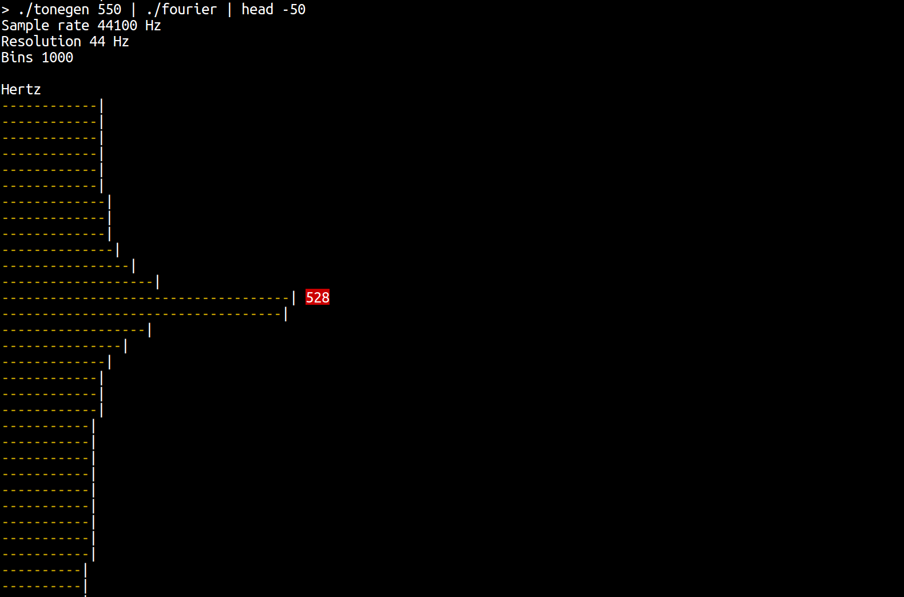

Command line Fourier analysis and tone generator. See
[YouTube](https://www.youtube.com/watch?v=hwsOKpBg6zo) for a demo. The code is
written in pure C++ using no third-party libraries (bar the STL :)). 

# Resources
* [Fourier transform on Wikipedia](https://en.wikipedia.org/wiki/Fourier_transform#Example)
* [ANSI control codes](http://misc.flogisoft.com/bash/tip_colors_and_formatting)
